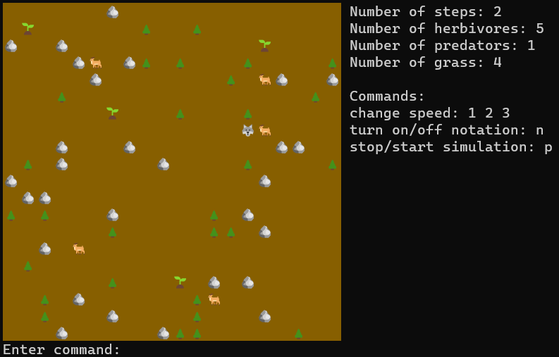

# LifeSimulation
This is a command-line application that represents step-by-step 2D simulation of a world populated by herbivores and predators.
## Overview

This project is a 2D step-by-step simulation of a world populated by predators and herbivores.
The simulation takes place on a map that also contains grass (food for herbivores), trees and rocks (obstacles).

The predators hunt the herbivores, while the herbivores search for grass to eat and avoid predators.
The simulation continues until all the herbivores are eliminated.




## Features

- **World Generation:** The simulation generates a world with a specified size and a random distribution of all entities.

- **Movement:** Herbivores and predators use the Breadth First Search(BFS) algorithm to find prey.

- **Eating:** Herbivores eat plants, which are randomly distributed on the grid and generated during the simulation. Predators eat herbivores.

- **Death:** Herbivores die if they go too many turns without eating.

- **Control:** User commands processing in a separate thread, allowing for simulation interaction.


## Usage

To use this project, simply compile and run the .jar file.
```sh
mvn clean install
java -jar target/Simulation.jar
```